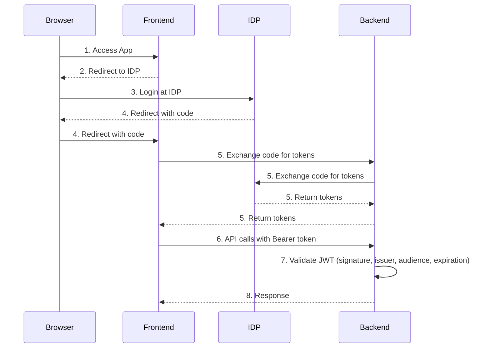

# Authentication Configuration Guide

This document shows how to configure an Identity Provider (IDP) for the Rego Adventure application. Keycloak is used as the primary example, but the principles apply to any OIDC-compliant provider.

## Overview

The Rego Adventure application implements **OIDC/OAuth2 Authorization Code Flow** for user authentication. Here's how it works:

- **Optional Authentication**: Authentication can be enabled or disabled via environment variables
- **OIDC-Compliant**: Works with any OIDC-compliant identity provider (Keycloak, Auth0, Okta, Azure AD, etc.)
- **Stateless Backend**: JWT-based authentication with JWKS signature validation
- **Modern Frontend**: Uses the `oidc-client-ts` library for seamless authentication flows

When authentication is disabled, the application runs in open mode—no user login required.

## Architecture

### Authentication Flow



## Environment Variables

You'll need to set these environment variables to enable and configure authentication:

| Variable | Required | Description | Example |
|----------|----------|-------------|---------|
| `AUTH_ENABLED` | Yes | Enable/disable authentication | `true` or `false` |
| `AUTH_ISSUER` | When enabled | OIDC issuer URL (must match token `iss` claim) | `https://keycloak.example.com/realms/myrealm` |
| `AUTH_DISCOVERY_URL` | When enabled | OIDC discovery endpoint URL | `https://keycloak.example.com/realms/myrealm/.well-known/openid-configuration` |
| `AUTH_CLIENT_ID` | When enabled | OAuth2 client identifier | `rego-adventure` |
| `AUTH_AUDIENCE` | When enabled | Expected audience in JWT tokens | `rego-adventure` |
| `DOMAIN` | Yes | Application domain (used for CORS) | `https://adventure.example.com` |

## Keycloak Configuration

Here's how to set up Keycloak as your identity provider.

### Create a Client

1. Navigate to **Clients** in the left sidebar
2. Click **"Create client"**
3. Configure the client:

   **General Settings:**
   - **Client type**: `OpenID Connect`
   - **Client ID**: `rego-adventure` (must match `AUTH_CLIENT_ID`)
   - **Name**: `Rego Adventure` (display name)
   - **Description**: `Rego Adventure Game Application`
   - Click **"Next"**

   **Capability config:**
   - **Client authentication**: `OFF` (public client)
   - **Authorization**: `OFF`
   - **Authentication flow**: Enable only:
     - Standard flow
   - **PKCE Method**: `S256`
   - Click **"Next"**

   **Login settings:**
   - **Root URL**: `https://adventure.example.com` (your domain)
   - **Home URL**: `https://adventure.example.com`
   - **Valid redirect URIs**: 
     ```
     https://adventure.example.com/callback
     ```
   - **Valid post logout redirect URIs**: 
     ```
     https://adventure.example.com/
     ```
   - **Web origins**: 
     ```
     https://adventure.example.com
     ```
   - Click **"Save"**

### Configure Audience Mapper

The audience mapper is **essential** for token validation. Without it, tokens will be rejected by the backend.

1. Navigate to your client (`rego-adventure`)
2. Go to **"Client scopes"** tab
3. Click on the dedicated scope (e.g., `rego-adventure-dedicated`)
4. Click **"Add New mapper"**
5. Select **"Audience"**
6. Configure the mapper:
   - **Name**: `audience-mapper`
   - **Included Client Audience**: `rego-adventure` (must match `AUTH_AUDIENCE`)
   - **Add to ID token**: `OFF`
   - **Add to access token**: `ON`
   - Click **"Save"**

## Other Identity Providers

This guide focuses on Keycloak, but the application works with any OIDC-compliant provider. Here's what you need to know for a few common alternatives.

### Auth0

Here's what differs when using Auth0:
- **Issuer**: `https://your-tenant.auth0.com/`
- **Discovery URL**: `https://your-tenant.auth0.com/.well-known/openid-configuration`
- **Audience**: Configure in Auth0 API settings
- **Client**: Create a "Single Page Application" in Auth0

**Auth0-specific steps:**
1. Create an Application (type: Single Page Application)
2. Configure Allowed Callback URLs: `https://adventure.example.com/callback`
3. Configure Allowed Logout URLs: `https://adventure.example.com/`
4. Configure Allowed Web Origins: `https://adventure.example.com`
5. Create an API in Auth0 to get an audience identifier
6. Set `AUTH_AUDIENCE` to your API identifier

### Okta

Here's what differs when using Okta:
- **Issuer**: `https://your-domain.okta.com/oauth2/default`
- **Discovery URL**: `https://your-domain.okta.com/oauth2/default/.well-known/openid-configuration`
- **Client**: Create a "Single-Page App" in Okta

**Okta-specific steps:**
1. Create an Application (type: Single-Page App)
2. Configure Sign-in redirect URIs: `https://adventure.example.com/callback`
3. Configure Sign-out redirect URIs: `https://adventure.example.com/`
4. Configure Trusted Origins: `https://adventure.example.com`
5. Assign users to the application
6. Use the default authorization server or create a custom one

### Azure AD / Microsoft Entra ID

Here's what differs when using Azure AD:
- **Issuer**: `https://login.microsoftonline.com/{tenant-id}/v2.0`
- **Discovery URL**: `https://login.microsoftonline.com/{tenant-id}/v2.0/.well-known/openid-configuration`
- **Client**: Create an "App registration" in Azure Portal

**Azure AD-specific steps:**
1. Register an application in Azure Portal
2. Configure Redirect URIs (type: Single-page application): `https://adventure.example.com/callback`
3. Configure Logout URL: `https://adventure.example.com/`
4. Enable ID tokens and Access tokens
5. Configure API permissions (Microsoft Graph: openid, profile, email)
6. Set `AUTH_AUDIENCE` to the Application (client) ID
7. Note: Azure AD uses `api://{client-id}` format for audience in some cases

### Generic OIDC Provider

For any OIDC-compliant provider, you'll need to do the following:

1. **Create a client/application** with these settings:
   - Application type: Single Page Application (SPA) or Public Client
   - Grant type: Authorization Code with PKCE
   - Response type: `code`

2. **Configure redirect URIs**:
   - Callback: `{DOMAIN}/callback`
   - Logout: `{DOMAIN}/`

3. **Configure CORS/Origins**:
   - Add your application domain

4. **Obtain configuration values**:
   - Issuer URL (usually the base URL of the IDP)
   - Discovery endpoint (usually `{issuer}/.well-known/openid-configuration`)
   - Client ID (provided by IDP)
   - Audience (may be same as client ID or a separate API identifier)

5. **Verify token claims**:
   - Make sure access tokens include `aud` claim matching your `AUTH_AUDIENCE`
   - Make sure `iss` claim matches your `AUTH_ISSUER`

