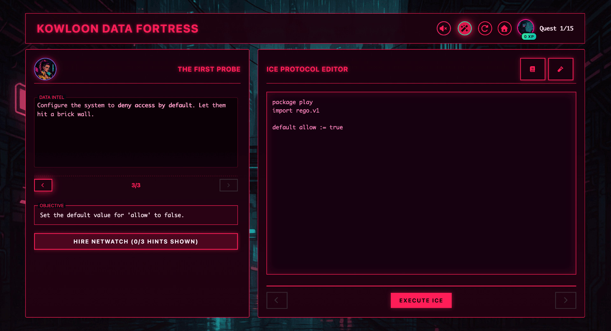
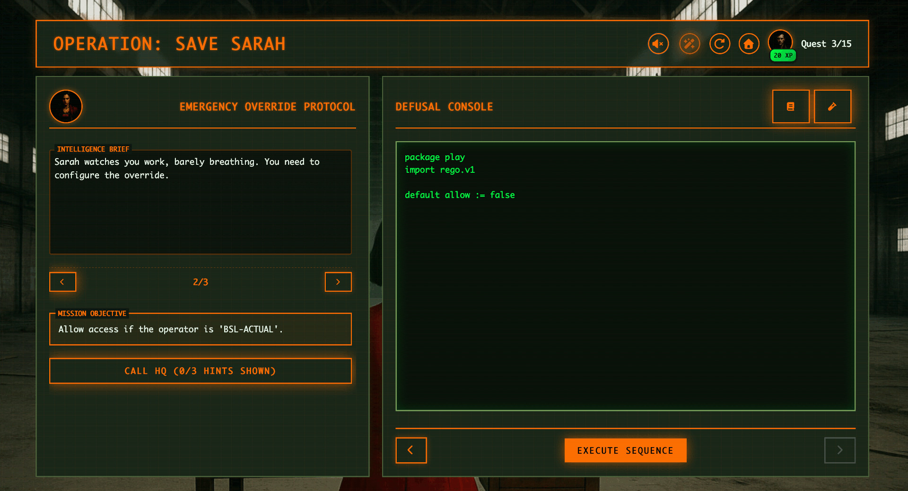
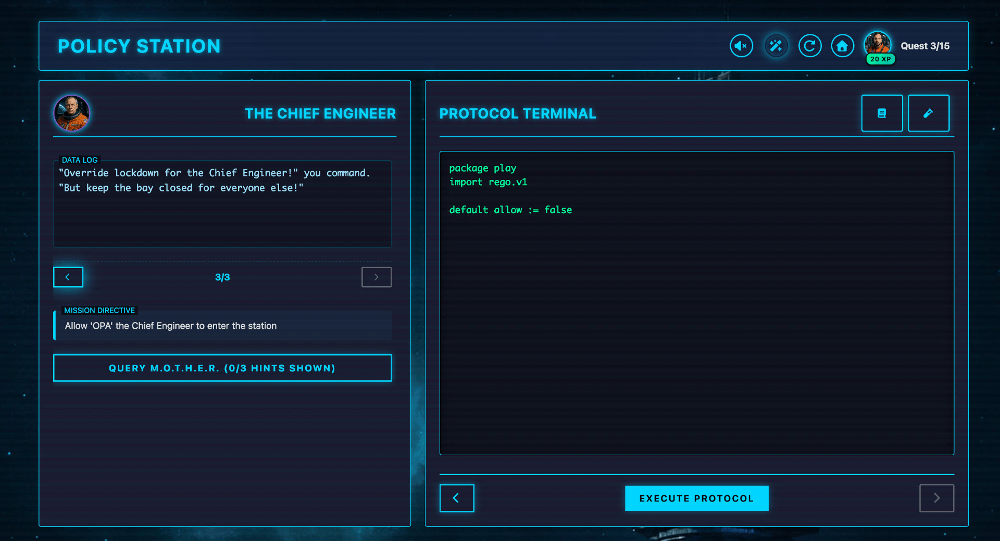

# Rego Adventure

An interactive learning platform for mastering Policy-Based Access Control (PBAC) using Open Policy Agent (OPA) and Rego policy language through themed quest-based challenges.

## example deployment

A deployment with custom quests exists at [https://regoadventure.r5i.xyz](https://regoadventure.r5i.xyz).

Use the following credentials:
- user: rego
- pass: adventure

### Gallery

<p align="center">
  <a href="docu/images/screenshot_ui_1.jpg"></a>
  <a href="docu/images/screenshot_ui_2.jpg"></a>
</p>
<p align="center">
  <a href="docu/images/screenshot_ui_3.jpg"></a>
  <a href="docu/images/screenshot_ui_4.jpg"></a>
</p>

## Architecture

### Backend (Go)

- **HTTP Server**: gin-gonic based REST API
- **Quest System**: Dynamic quest pack loading from JSON files
- **Policy Verification**: OPA integration for Rego policy evaluation against test cases
- **Authentication**: Optional OIDC/JWT authentication with JWKS validation

**Key Components:**
- [`main.go`](main.go:1) - Application entry point and initialization
- [`internal/http/`](internal/http/) - HTTP server, routing, and middleware
- [`internal/quest/`](internal/quest/) - Quest models, repository, and verification logic
- [`internal/config/`](internal/config/) - Configuration management

### Frontend (JavaScript)

- **Adventure Interface**: Single-page application for quest progression
- **Theme System**: Dynamic styling based on quest pack genre

**Structure:**
- [`frontend/adventure/`](frontend/adventure/) - Main game interface
- [`frontend/quests/`](frontend/quests/) - Quest pack definitions (JSON) and assets

## Prerequisites

- Go 1.25 or higher
- Docker (optional, for containerized deployment)
- Kubernetes cluster (optional, for K8s deployment)

## Installation

### Local Development

1. Clone the repository
2. Install dependencies:
   ```bash
   go mod download
   ```

3. Set required environment variables:
   ```bash
   export DOMAIN="http://localhost:8080"
   export PORT="8080"
   ```

4. Optional authentication configuration:
   ```bash
   export AUTH_ENABLED="true"
   export AUTH_ISSUER="https://your-issuer.com"
   export AUTH_DISCOVERY_URL="https://your-issuer.com/.well-known/openid-configuration"
   export AUTH_CLIENT_ID="your-client-id"
   export AUTH_AUDIENCE="your-audience"
   ```

5. Run the application:
   ```bash
   go run main.go
   ```

## Running the Application

### Development Mode

```bash
go run main.go
```

Access the application at `http://localhost:8080`

### Production Build

```bash
go build -ldflags "-s -w" -trimpath -o rego-adventure .
./rego-adventure
```

### Docker

Build the image:
```bash
docker build -t rego-adventure .
```

Run the container:
```bash
docker run -p 8080:8080 \
  -e DOMAIN="http://localhost:8080" -e PORT="8080" \
  rego-adventure
```

See [`docker-compose.yml`](docu/deploy/docker/docker-compose.yml) for Docker Compose configuration.

### Kubernetes

Deploy using the provided manifests.

Either:

```bash
kubectl apply -k docu/deploy/k8s
```

Or, ff you prefer to apply files individually:

```bash
kubectl apply -f docu/deploy/k8s/configmap.yaml
kubectl apply -f docu/deploy/k8s/deployment.yaml
kubectl apply -f docu/deploy/k8s/service.yaml
kubectl apply -f docu/deploy/k8s/ingress.yaml
```

Configuration is managed via ConfigMap. Update [`configmap.yaml`](docu/deploy/k8s/configmap.yaml) with your environment-specific values.

## Project Structure

```
.
├── main.go                # Application entry point
├── cmd/
│   └── assetgen/          # Quest pack asset generator
├── internal/
│   ├── config/            # Configuration management
│   ├── http/              # HTTP server and routing
│   └── quest/             # Quest system logic
├── frontend/
│   ├── adventure/         # Main game interface
│   ├── quests/            # Quest packs (JSON + assets)
│   └── shared/            # Shared CSS, fonts, and resources
├── docu/
│   └── deploy/            # Deployment configurations
│       ├── docker/        # Docker Compose
│       └── k8s/           # Kubernetes manifests
├── Dockerfile             # Multi-stage container build
└── go.mod                 # Go dependencies
```

## Configuration

### Environment Variables

| Variable | Required | Default | Description |
|----------|----------|---------|-------------|
| `DOMAIN` | Yes | - | Application domain (e.g., `https://example.com`) |
| `PORT` | No | `8080` | HTTP server port |
| `AUTH_ENABLED` | No | `false` | Enable OIDC authentication |
| `AUTH_ISSUER` | Conditional | - | OIDC issuer URL (required if auth enabled) |
| `AUTH_DISCOVERY_URL` | Conditional | - | OIDC discovery endpoint (required if auth enabled) |
| `AUTH_CLIENT_ID` | Conditional | - | OIDC client ID (required if auth enabled) |
| `AUTH_AUDIENCE` | Conditional | - | JWT audience claim (required if auth enabled) |
| `TRUSTED_PROXIES` | No | - | Comma-separated CIDR ranges for trusted proxies |
| `SHOW_IMPRESSUM` | No | `false` | Enable impressum/legal notice page link in footer |
| `RATE_LIMIT_ENABLED` | No | `false` | Enable rate limiting for API and frontend endpoints |
| `RATE_LIMIT_API` | No | `5` | API requests per second (for `/api/*` endpoints) |
| `RATE_LIMIT_FRONTEND` | No | `50` | Frontend requests per second (for non-API endpoints) |
| `RATE_LIMIT_WINDOW` | No | `1` | Time window in seconds for rate limiting |

**ATTENTION**: When deployed behind a proxy or running in a containerized environment, 
**especially** when enabling the **rate-limiter**, setting `TRUSTED_PROXIES` is crucial. 
Only if the proper proxy is set, the rate limiter will use the original IP address rather than using the IP of the proxy.

### Rate Limiting Configuration

The application includes a very basic rate limiting support to protect against abuse. However, protecting your deployments via more sophisticated options is advised.

**Rate Limiting Behavior:**

- **API Endpoints** (`/api/*`): More restrictive limits for policy verification and quest-related operations (default: 5 requests per second)
- **Frontend Endpoints**: Higher limits for static content and general application pages (default: 50 requests per second)

**Configuration:**

Enable or disable rate limiting:
```bash
export RATE_LIMIT_ENABLED="true"
```

Configure API endpoint limits:
```bash
export RATE_LIMIT_API="5"           # Requests per second for /api/* endpoints
```

Configure frontend endpoint limits:
```bash
export RATE_LIMIT_FRONTEND="50"     # Requests per second for non-API endpoints
```

Configure time window:
```bash
export RATE_LIMIT_WINDOW="1"        # Time window in seconds (default: 1)
```

**Important Notes:**
- When rate limits are exceeded, clients receive a `429 Too Many Requests` response
- The rate limiter automatically cleans up stale entries to prevent memory leaks
- Ensure `TRUSTED_PROXIES` is properly configured when behind a proxy to rate limit by actual client IP

### Impressum / Legal Notice Configuration

The application includes an optional impressum (legal notice) page that can be enabled for deployments requiring legal compliance (e.g., German TMG requirements).

**Enable the Impressum Page:**

Set the `SHOW_IMPRESSUM` environment variable to `true`:
```bash
export SHOW_IMPRESSUM="true"
```

**Customize the Impressum Content:**

The default impressum page at [`frontend/adventure/impressum.html`](frontend/adventure/impressum.html) is a template with placeholder content. You **must** customize it with your actual legal information before deploying to production.

**Docker Deployment:**

Override the impressum file using a volume mount in your `docker-compose.yml`:

```yaml
services:
  rego-adventure:
    # ... other configuration ...
    environment:
      - SHOW_IMPRESSUM=true
    volumes:
      # Mount your custom impressum file
      - ./custom-impressum.html:/app/frontend/adventure/impressum.html:ro
```

Create your `custom-impressum.html` file with your actual legal information, then start the container.

**Kubernetes Deployment:**

**Option 1: Using a ConfigMap (Recommended)**

1. Create a ConfigMap with your custom impressum content:

```bash
kubectl create configmap impressum-html --from-file=impressum.html=./custom-impressum.html
```

2. Update your deployment to mount the ConfigMap:

```yaml
apiVersion: apps/v1
kind: Deployment
metadata:
  name: rego-adventure
spec:
  template:
    spec:
      containers:
        - name: rego-adventure
          env:
            - name: SHOW_IMPRESSUM
              value: "true"
          volumeMounts:
            - name: impressum-volume
              mountPath: /app/frontend/adventure/impressum.html
              subPath: impressum.html
              readOnly: true
      volumes:
        - name: impressum-volume
          configMap:
            name: impressum-html
```

**Option 2: Using a PersistentVolume**

Mount a PersistentVolume containing your custom impressum.html file to `/app/frontend/adventure/impressum.html`.

**Important Notes:**
- The impressum page is disabled by default (`SHOW_IMPRESSUM=false`)
- When enabled, a link appears in the application footer
- Always replace placeholder content with actual legal information
- Ensure compliance with your local legal requirements (TMG, GDPR, etc.)

## Quest Packs

Quest packs are defined in JSON format in a dedicated folder under [`frontend/quests/`](frontend/quests/) (for example: `frontend/quests/my-quest-pack`). Each pack contains:

- Metadata (title, description, genre)
- Prologue and epilogue narratives
- Quest definitions with test cases
- Theme-specific assets (images, audio, styles)

### Asset Generator

The asset generator tool creates new quest pack scaffolding with placeholder assets and configuration files.

**Location:** [`cmd/assetgen/`](cmd/assetgen/)

**Usage:**
```bash
go run cmd/assetgen/main.go -theme <theme-name> -output <output-directory>
```

**Example:**
```bash
go run cmd/assetgen/main.go -theme western -output frontend/quests

# creates a folder "western" below "frontend/quests"
```

**Generated Files:**
- `quests.json` - Quest pack definition with 3 sample quests
- `theme.css` - Theme-specific CSS variables and overrides
- `custom.css` - Template for theme-specific visual effects
- `README.md` - Quest pack customization guide
- `assets/` - Directory containing placeholder images:
  - `bg-adventure.jpg` (1920x1080) - Background image
  - `hero-avatar.png` (128x128) - Player avatar
  - `npc-questgiver.png` (128x128) - Quest giver avatar
  - `icon-success.png` (128x128) - Success icon
  - `icon-failure.png` (128x128) - Failure icon
  - `perfect_score.png` (512x512) - Perfect score image
  - `bg-music.m4a` - Empty placeholder for background music

All generated images are solid color placeholders. Replace with theme-appropriate artwork before deployment.

### Mounting Quest Packs

Custom quest packs can be added to the application by mounting them into the container. The target directory is `/app/frontend/quests/`.

**Docker:**

Mount your local quest pack folder to a subdirectory within `frontend/quests`:

```bash
docker run -v ./my-pack:/app/frontend/quests/my-pack ...
```

**Docker Compose:**

Mount your local quest pack folder using the `volumes` configuration:

```yaml
volumes:
  - ./my-pack:/app/frontend/quests/my-pack
```

**Kubernetes:**

Mount a volume containing your quest pack structure to the same path:

```yaml
volumeMounts:
  - name: my-quest-pack
    mountPath: /app/frontend/quests/my-pack
```

## Quest Editor

A browser-based visual editor for creating and modifying quest packs. The editor provides a complete interface for managing all aspects of quest pack development without requiring manual JSON editing.

**Location:** [`docu/quest-editor/`](docu/quest-editor/)

**How to Use:**
1. Open [`index.html`](docu/quest-editor/index.html) in a web browser
2. Click "Load Quest File" and select a `quests.json` file from any quest pack
3. Edit quest content using the visual interface
4. Click "Save" to download the modified `quests.json` file

For a more complete documentation, see [`README_EDITOR.md`](README_EDITOR.md).

## Deployment

The application is designed for cloud-native deployment with:

- Read-only root filesystem support
- Non-root user execution (UID 10001)
- Health check endpoints (`/health`)

Refer to 

- [`Dockerfile`](Dockerfile) for container build configuration
- [`docker-compose.yml`](docu/deploy/docker/docker-compose.yml) for docker-based setups, and
- [`kustomization.yaml`](docu/deploy/k8s/kustomization.yaml) for Kubernetes deployments.

### Quest Packs Deployment

Locally, a quest pack must be put below the `frontend/quests` folder.

For Kubernetes or Docker Compose deployments, they can mount the quest packs below this directory.

## License

This project is licensed under the Apache License 2.0 - see the [LICENSE](LICENSE) file for details.

## Copyright

Copyright 2025 Mario Enrico Ragucci - see [COPYRIGHT.md](COPYRIGHT.md) for details.