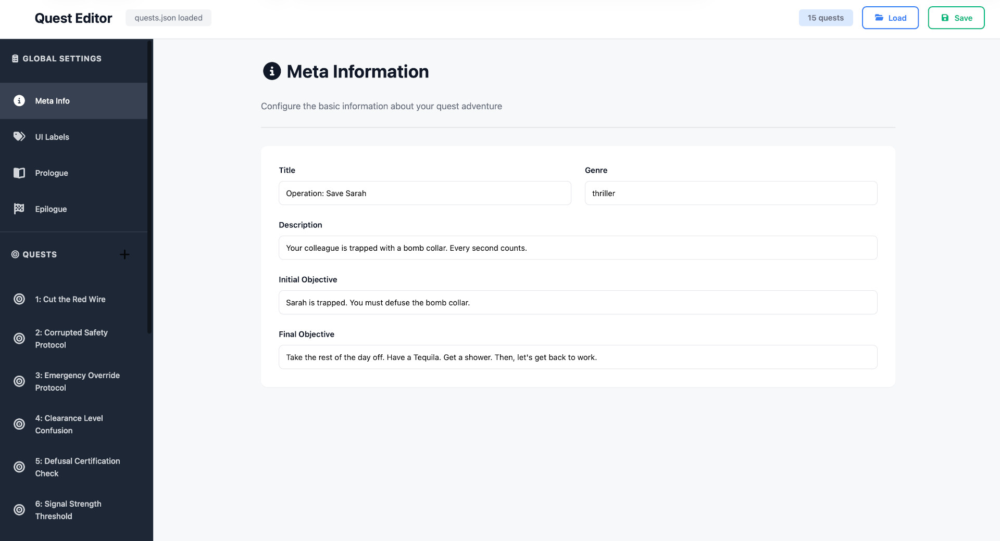
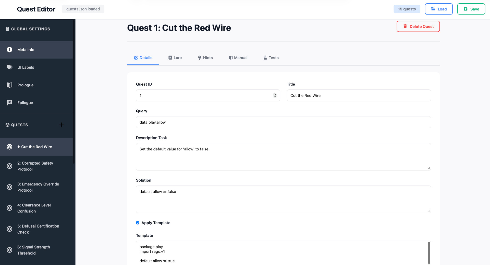
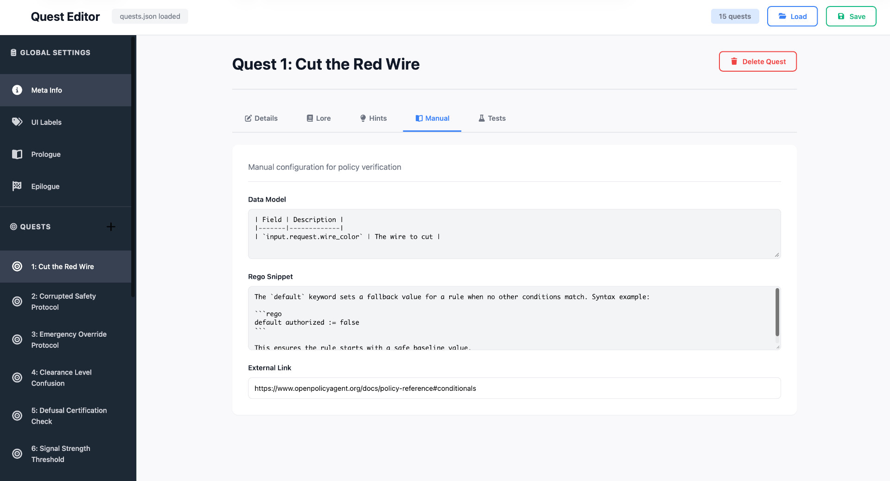
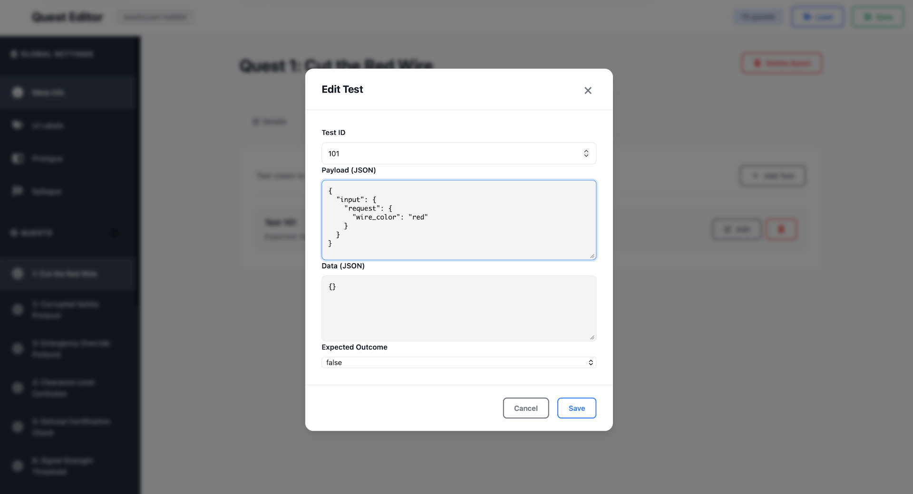

# Quest Editor

A browser-based tool for creating and editing quest packs for the Rego Adventure game.

## What It Does

The quest editor loads `quests.json` files, lets you edit them, and saves them back out. It handles all the quest pack structure - metadata, UI labels, prologue/epilogue text, individual quests, and test cases.

## Gallery

  
  

  
  

## Getting Started

1. Open [`index.html`](docu/quest-editor/index.html) in a browser
2. Click "Load Quest File" and select a `quests.json` file
3. Edit your content
4. Click "Save" to download the modified file

## Interface Layout

### Sidebar Navigation

**Global Settings:**
- Meta Info - title, description, genre, objectives
- UI Labels - button text, messages, theme-specific labels
- Prologue - intro story elements (array of text blocks)
- Epilogue - ending story elements (array of text blocks)

**Quests:**
- List of all quests in the pack
- Click to edit a specific quest
- Add new quests with the + button

### Quest Editor Tabs

Each quest has five tabs:

**Details** - Core quest configuration:
- ID and title
- Query path (e.g., `data.play.allow`)
- Task description
- Solution code
- Template code and apply flag

**Lore** - Story elements (array of text blocks)

**Hints** - Ordered hints for players (array of text)

**Manual** - Reference documentation:
- Data model description
- Rego snippet/examples
- External link (optional)

**Tests** - Test cases with:
- Test ID
- Payload (input data)
- Data (external data context)
- Expected outcome (true/false)

## Working with Test Cases

Test cases validate quest solutions. Click "Add Test" to create one, "Edit" to modify it.

Each test needs:
- Unique ID within the quest
- Payload object (becomes `input` in Rego)
- Data object (becomes `data` in Rego, optional)
- Expected outcome boolean

The editor validates that quest IDs and test IDs are unique before saving.

## Quest Pack Structure

See [`docu/quests.md`](docu/quests.md) for the complete specification of the quest pack format, including:
- Top-level structure
- Quest object fields
- Test case format
- Template behavior

## Technical Details

Single-Page Application (SPA).

**Dependencies:**
- Font Awesome 7.0.1 (icons)

**Browser Requirements:**
- Modern browser with ES6 support
- File API for loading/saving

## Creating Quest Packs

**Start from existing:**
Use the `asset generator` to create a skeleton for the new quest. 
Load the generated `quests.json` and modify it.

**Key points:**
- Quest IDs must be unique
- Test IDs must be unique within each quest
- Use `apply_template: true` to replace editor content
- Leave `apply_template: false` to keep user's code
- Template field can be empty if not used

**UI Labels:**
Customize button text and messages to match your theme. Examples:
- Fantasy: "Ancient Scrolls", "Consult the Oracle"
- Cyberpunk: "ICE Protocol Editor", "Query NetWatch"
- Noir: "Case Files", "Call Veronica"

**Test Coverage:**
- Minimum 2-3 tests per quest
- At least one passing case
- At least one failing case
- Edge cases where relevant

## Tips

**Organizing quests:**
- Use sequential IDs (1, 2, 3...)
- Keep titles short and clear
- Put easier quests first

**Writing tests:**
- Start simple, add complexity
- Test boundary conditions
- Include both positive and negative cases

**Templates:**
- Use for "fix this code" quests or to reset to a "clean state"
- Include helpful comments
- Mark broken sections clearly

**Hints:**
- Hint 1: General approach
- Hint 2: Specific function/syntax
- Hint 3: Near-complete solution

**Manual sections:**
- Data model: List available fields
- Rego snippet: Show syntax examples
- External link: OPA docs or relevant resources

## License

This project is licensed under the Apache License 2.0 - see the [LICENSE](LICENSE) file for details.

## Copyright

Copyrigh 2025 Mario Enrico Ragucci - see [COPYRIGHT.md](COPYRIGHT.md) for details.